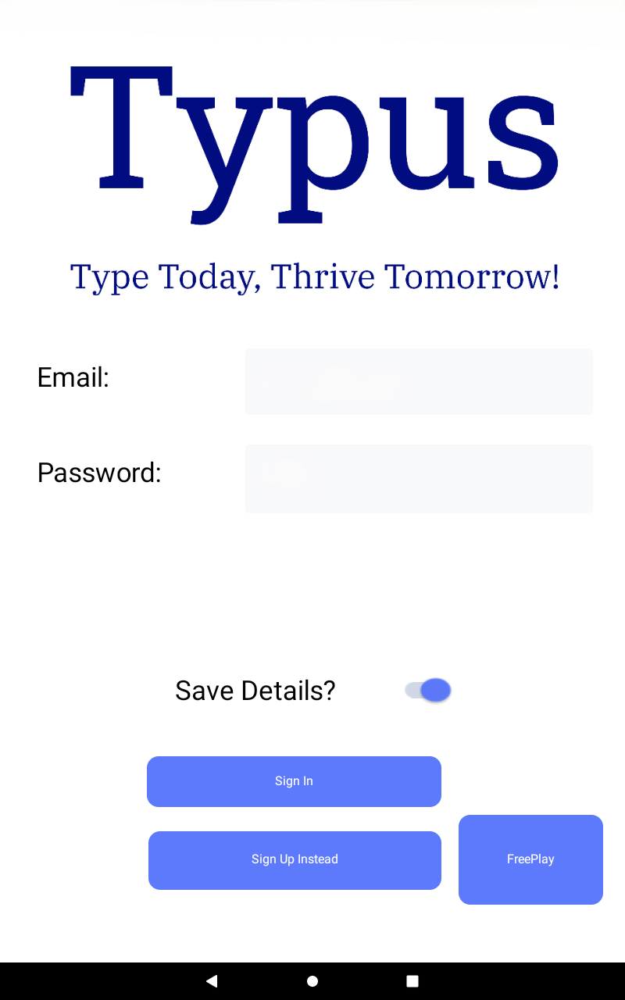

# Typus

## Collaborative Full-Stack Application (SCRUM Project)

> Team Lead / SCRUM Master – Agile Software Development

Served as SCRUM Master for a team of four, leading the development of a full-stack application in a collaborative, Agile environment. Oversaw sprint planning, task distribution, and iterative feature delivery to ensure effective communication and workflow continuity.

{alt="Typus Logo"}

Collaborated on building the frontend, which was designed using a UI tool that generates React Native code, and developed the backend using Google Firebase, integrating features such as Authentication, Realtime Database, and Cloud Functions.

Implemented and deployed multiple Firebase Cloud Functions:

A JavaScript function for calculating Levenshtein distance between string entries.

A Python function for formatting and sorting data entries, tested via Postman for validation and performance.

Employed Git and GitHub for version control and project management, using GitHub Projects for task tracking, Issues for bug reporting, Wikis for documentation, and Pages for hosting user-facing content.

{atl="Typus Welcome Page"}

Skills: React Native, JavaScript, Python, Firebase, Cloud Functions, Git, GitHub, Agile, SCRUM, Full-Stack Development
